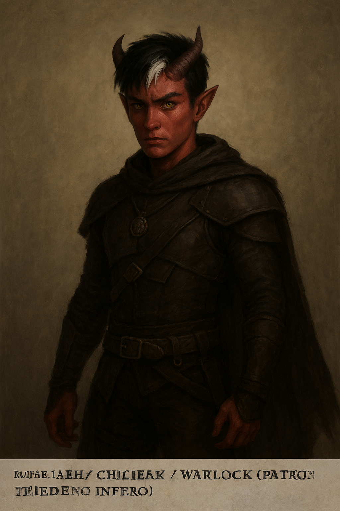

# 🔮 Kai Hansen - Tiefling Infernal - Bruxo Patrono Ínfero - Criminoso

> _Kai Hansen nasceu em uma família tiefling pacífica, perseguida por nobres que desprezavam sua raça. Durante um ataque devastador, foi o único sobrevivente e foi entregue a parentes distantes, que o tratavam como servo. Anos de opressão e trabalho forçado o endureceram; quando adolescente, fugiu para as ruas, sobrevivendo com astúcia e pequenos crimes. Lá, encontrou a oportunidade de fazer um pacto com um Patrono Ínfero, garantindo poder e independência. Agora, Kai caminha pelo mundo com carisma e frieza, dominando magia sombria e ataques precisos, sempre pronto para sobreviver e impor sua vontade._

- **Nível** 1
- **CA** 15 (+11 Armadura de Couro; +4 DEX)
- **PV** 10 (1d8 +2 CON)
- **Deslocamento** 9m
- **Iniciativa** +2
- **Sentidos** Visão no Escuro 18m e Percepção Passiva 11
- **Resistências** Resistencia a dano de fogo

## Atributos:

| Atributo           | Valor | Modificador                 |
| ------------------ | ----- | --------------------------- |
| Força (STR)        | 8     | -1                          |
| Destreza (DEX)     | 14    | +2 base +2 antecedente → +4 |
| Constituição (CON) | 12    | +1 base +1 antecedente → +2 |
| Inteligência (INT) | 10    | +0                          |
| Sabedoria (WIS)    | 13    | +1                          |
| Carisma (CHA)      | 15    | +2                          |

## Proficiência

- Bônus de proficiência: +2
- Bônus de ataque mágico (Warlock) = Modificador de Carisma + Proficiência = 2 + 2 = +4
- CD das magias = 8 + Proficiência + Modificador de Carisma = 8 + 2 + 2 = 12

## 💥 Ataques / Dano

| Magia / Truque | Alcance | Ataque / CD | Dano | Observações |
|----------------|--------|------------|------|------------|
| **Eldritch Blast** | 36 m | +4 | 1d10 força (+1d6 necrotic se Hex ativo) | Principal ataque à distância |
| **Fire Bolt** | 36 m | +4 | 1d10 fogo | Alternativa para variar ou sem Hex |
| **Hex** | 27 m | +4 ataques que aplicam Hex | +1d6 necrotic | Concentração 1h, marca alvo e impõe desvantagem em 1 teste de habilidade |
| **Charm Person** | 9 m | CD 12 | N/A | Encanta humanoide 1h, controle social/furtividade |

---

## 🛠 Truques / Utilidade

| Magia / Truque | Alcance | Observações |
|----------------|--------|------------|
| **Thaumaturgy** | 9 m | Efeitos visuais/sonoros para intimidação ou roleplay |
| **Minor Illusion** | 9 m | CD 12 para INT (Investigation). Distração, camuflagem |
| **Find Familiar** | 3 m (conjuração) | Familiar independente, pode usar Help ou espionagem. Pacto da Corrente: Imp, Quasit, Sprite ou Pseudodragon |

---

